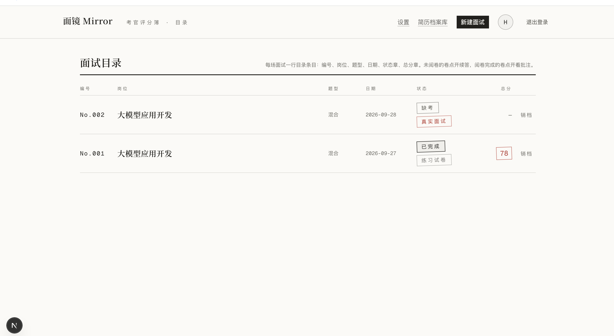
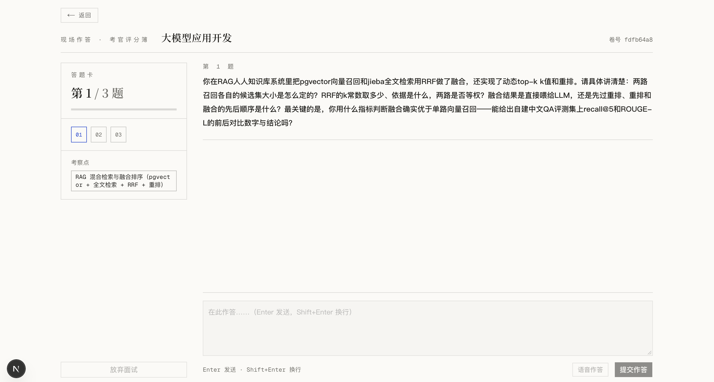

# 面镜 Mirror · AI 模拟面试

> 照镜子式演练：面试是自我认知的镜子，练习即反思。

**面镜 Mirror** 是一个面向中国互联网/泛技术岗求职者的 AI 模拟面试 Agent（文字对话）：上传简历 + 粘贴目标 JD，AI 面试官逐题提问并针对性追问，面试后产出逐题四维评分 + 雷达图 + 教练式改进报告——练完一场就能明确知道「差在哪、怎么改」。

两个不可被照抄的机制：

1. **追问由代码状态机而非 LLM 自主决定**——阈值 0.65、每题最多 1 次追问，是代码常量而非模型输出，追问始终围绕预设锚点，面试官不会「顺着候选人走」。
2. **评估 Agent 与面试官 Agent 人格隔离**——评估官只看题目与回答原文，看不到面试官的语气语境，评分独立不虚高。

## 界面预览

**面试目录（首页）**——状态章 / 模式章 / 总分章一眼可辨



**面试现场（真实面试 · 渐进出题）**——题干钉在卷面上方，作答流独立滚动



## 两种面试模式

**练习试卷**（一卷式）：自选题型（技能 / 项目 / 行为 / 混合）与题量（3-10 题），登记后一次性出卷，逐题作答。出卷过程有「誊写 → 装订成卷」的过场仪式。

**真实面试**（渐进出题）：综合题型锁定，题量三选（10 / 15 / 20）+ 难度三档（简单 = 基础知识点为主，中等 = 由简到难，困难 = 项目场景考察为主）。题目不预先存在——考官现场逐题生成，沿确定性难度阶梯推进（前 30% 基础热身禁项目深挖、中段核心考察、后 30% 项目深挖收尾），表现低迷会提前收尾（连 3 题 <0.40 或均值 <0.45，最少 5 题）。刷新可恢复，接续语义与现场一致。

真实面试的项目题走**「问穿」技能**（[`skills/project-grill/`](skills/project-grill/SKILL.md)，SKILL.md 为唯一事实来源）：每道项目题锁定简历中的一条具体 Claim（个人边界 / 指标口径 / 技术作用 / 架构边界 / 真实结果五类），追问只追最关键的缺失证据，按六类风险信号（模糊词、无口径数字、强表述无边界、只会 happy path、背术语、前后矛盾）验证真实掌握，候选人卡住时降阶为最小事实问题——把简历问穿，但不无限追问。

## 架构

> 交互式架构图见 [docs/architecture-mirror.html](docs/architecture-mirror.html)（浏览器打开，支持明暗主题 / 路径追踪 / 缩放；规格源在同目录 `architecture-mirror.json`）。

五个角色 Agent + 一个纯代码编排器。Agent = 独立人格 + 独立输出 schema（Zod）+ 独立模型配置；**编排器（状态机，纯代码，不占 LLM）是唯一事实来源**，决定「下一步做什么」，Agent 只负责各自领域的内容生成，彼此不互相对话、只通过编排器传递结构化产物。

```
练习模式：
创建(draft) ──简历分析Agent──▶ ResumeProfile ──出题Agent──▶ 题库(ready)
      ──开始──▶ in_progress ──答完N题──▶ completed ──报告Agent──▶ 报告

真实面试：
登记(ready) ──开始──▶ 现场生成第 1 题 ──▶ 每题循环：
    候选人回答 → 评估Agent逐题评分（四维 rubric，0-1 分）
    → 编排器决策（确定性规则）：
        追问：得分 < 0.65 且本题未追问（每题最多 1 次）
        下一题：现场生成（难度阶梯 opening→core→deep，历史感知去重）
        终止：目标题数（10/15/20）达成｜连 3 题 <0.40 或均值 <0.45 提前收尾（最少 5 题）
    → 每轮落盘 messages / evaluations / interviews.status（刷新可恢复）

两种模式共用：评估 → 追问/推进决策 → 落盘 → 报告 的管线；Agent 分工一致。
```

| Agent | 职责 | 模型分工 |
|---|---|---|
| 简历分析 `resume-analyst` | 简历文本结构化（经历/技能/亮点） | 廉价模型 |
| 出题 `question-setter` | 依据画像 + JD 出题（练习=整卷；真实=单题渐进，含追问锚点） | 廉价模型 |
| 面试官 `interviewer` | 现场话术：提问/追问/过渡/点评，流式输出，不做流程决策 | 廉价模型 |
| 评估 `evaluator` | 逐题按 rubric 打分 + 批注（严格考官人格） | 强模型 |
| 报告 `report-writer` | 汇总逐题评估 → 总分 + 雷达图 + 教练式建议 | 强模型 |

评分维度固定四个：relevance（相关性）/ depth（深度）/ structure（结构化）/ communication（沟通），逐题 0-1 分，报告层折算 0-100。

出题走多层容错：`schema-retry`（结构纠错重试 + 业务校验逼重试）+ `json-salvage`（截断闭合修复 + 嵌套拍平收割），廉价模型的结构化输出波动不致整卷失败。

## 简历档案库

- **PDF / Markdown / 文本粘贴**三入口：PDF 服务端抽取文本（扫描件拒收），Markdown 按 UTF-8 直读；档案支持**自定义命名**
- 上传成功即**后台自动生成结构化画像**（LLM），不阻塞页面；档案卡展开即见**简历原文**（摘录 / 全文）+ 画像摘要与技能标签，生成中 / 失败重试就地反馈
- 画像先行意味着首场面试免付画像分析等待

## 面试现场

- 对话式卷面：考官黑墨 / 候选人蓝墨 / 批改红章（三色油墨纪律），角色头像 + 考官输出 **Markdown 渲染**
- 应用式固定视口：左栏答题卡与底部输入框固定，作答流独立滚动；「题干只出现一次」——当前题钉在卷面上方，不与对话流重复
- 逐题批改章（四维分 + STAR 完整度）在作答完盖章落卷；追问轮有「追问」标记
- **语音作答**（可选）：录音 → 用户自配 ASR 转写回填作答框（见设置页 05-07 栏）

## 技术栈

- **Next.js 16**（App Router，TypeScript strict）+ React 19
- **Tailwind CSS v4 + shadcn/ui（Base UI）+ recharts**（评分雷达图）+ react-markdown（考官输出渲染）
- **Supabase**：Auth（邮箱 magic link）、Postgres（全部表启用 RLS）、Storage（简历原件）
- **Vercel AI SDK**（`ai` + `@ai-sdk/openai-compatible`）：任何 OpenAI 兼容端点均可接入，模型按 Agent 粒度可配
- **pnpm**；部署目标 Vercel（serverless，无自建长连接）
- **vitest** 169 用例（编排器 / Agent 提示词契约 / 抢救链 / 设置 / 语音 / 导航）

## 本地开发

### 1. 安装依赖

```bash
pnpm install
```

### 2. 配置环境变量

复制 `.env.example` 为 `.env.local` 并填写：

```bash
cp .env.example .env.local
```

| 变量 | 含义 |
|---|---|
| `NEXT_PUBLIC_SUPABASE_URL` | Supabase 项目 URL（Dashboard → Project Settings → API） |
| `NEXT_PUBLIC_SUPABASE_ANON_KEY` | Supabase 匿名公钥，前端与服务端共享（有 RLS 兜底，不含服务端权限） |
| `LLM_BASE_URL` | LLM 的 OpenAI 兼容端点（如 `https://api.openai.com/v1`、DeepSeek、火山方舟等） |
| `LLM_API_KEY` | 该端点的 API Key |
| `LLM_CHAT_MODEL` | 廉价模型：简历分析/出题/面试官话术使用（如 `gpt-4o-mini`） |
| `LLM_EVAL_MODEL` | 可选：强模型，评估/报告专用（如 `gpt-4o`）；不配则回落到 `LLM_CHAT_MODEL` |
| `SETTINGS_SECRET` | 用户级 LLM 设置（API Key）的加密密钥：任意高熵随机串（如 `openssl rand -base64 32` 生成）。丢失或更换后，已存用户 key 无法解密（自动回落系统默认，设置页会提示重新填写），务必妥善备份 |
| `ASR_BASE_URL` | 可选，用户级 BYOK 配置的回落：语音识别的 OpenAI 兼容端点（`/audio/transcriptions`）；不配则逐字段回落用户的 LLM 端点 |
| `ASR_API_KEY` | 可选，用户级 BYOK 配置的回落：语音识别端点的 API Key；不配则逐字段回落用户的 LLM Key |
| `ASR_MODEL` | 可选，用户级 BYOK 配置的回落：语音识别模型（如 `whisper-1`）；不配则语音作答不可用 |

逐字段回落链：用户 ASR 配置 → 用户已存 LLM 配置 → 环境变量 `ASR_*` → 环境变量 `LLM_*`（模型仅认用户配置与 `ASR_MODEL`，不回落 LLM 模型）。

### 3. 初始化数据库

打开 Supabase Dashboard → **SQL Editor**，把 [`supabase/migrations/0001_init.sql`](supabase/migrations/0001_init.sql) 的全部内容粘贴进去执行。该脚本建 7 张表（profiles / resumes / interviews / questions / messages / evaluations / reports）并启用 RLS，同时创建简历 PDF 的 Storage bucket 与策略。

再**依次执行**：

- [`0002_user_settings.sql`](supabase/migrations/0002_user_settings.sql)：user_settings 表（用户级 LLM 设置）。未执行时设置页可浏览但无法保存。
- [`0003_asr_settings.sql`](supabase/migrations/0003_asr_settings.sql)：ASR 配置列，语音作答依赖。
- [`0004_real_mode.sql`](supabase/migrations/0004_real_mode.sql)：interviews 加 mode 列、questions 加 (interview_id, idx) 唯一索引，真实面试模式依赖。
- [`0005_real_mode_options.sql`](supabase/migrations/0005_real_mode_options.sql)：interviews 加 target_questions / difficulty 列，题数与难度选项依赖。
- [`0006_resume_name.sql`](supabase/migrations/0006_resume_name.sql)：resumes 加 name 列，简历自定义命名依赖。

### 4. 开启 Auth 提供方

- **Email（必开）**：Dashboard → Authentication → Sign In / Providers → Email 开启（magic link 模式使用）。
- 在 Supabase → Authentication → URL Configuration 的 Redirect URLs 中加入 `http://localhost:3000/auth/callback`（生产环境加 `https://<your-domain>/auth/callback`），登录回跳由此路由换取会话。

### 5. 启动

```bash
pnpm dev
```

打开 http://localhost:3000 即可。测试：

```bash
pnpm test
```

## 部署到 Vercel

1. 把仓库导入 Vercel（New Project → 选择 repo），框架预设 Next.js，**构建命令与安装命令保持默认**（`pnpm build`），无需改动。
2. 在 Project → Settings → Environment Variables 中添加 `.env.example` 的全部变量（含 `SETTINGS_SECRET`；`ASR_*` 三项可选）。`NEXT_PUBLIC_` 前缀的两个变量会进入浏览器 bundle，这是 Supabase 设计如此（安全由 RLS 保证）。
3. 在 Supabase → Authentication → URL Configuration 中把生产域名加入 Redirect URLs：`https://<your-vercel-domain>/auth/callback`。
4. Deploy。数据库迁移需先于上线在 Supabase SQL Editor 执行完毕（见「本地开发 → 初始化数据库」）。

## 目录结构

```
app/
  api/
    resume/parse/            # PDF/Markdown 上传解析（pdf-parse / UTF-8 直读）
    resume/profile/          # 简历画像幂等生成（上传后预热 / 展开兜底共用）
    interview/create/        # 登记：练习=出卷；真实=即时返回待现场出题
    interview/start/         # 开始面试：首题（真实模式现场生成）+ 流式开场
    interview/answer/        # 提交回答 → 评估 → 编排器决策追问/下一题（流式）
    interview/[id]/next-question/ # 真实面试现场生成下一题（流式）
    interview/[id]/status/   # 面试状态（刷新恢复 / 进度）
    interview/[id]/abandon/  # 放弃面试（灰章「缺考」，异步落章）
    interview/report/        # 报告 Agent 汇总生成报告
    settings/                # 用户级 LLM 设置：GET 掩码形态 / PUT 保存（加密入库）
    settings/test/           # 测试连接（草稿可测）
    settings/test-asr/       # 测试语音转写链路
    voice/transcribe/        # 语音作答：录音转发到用户自配 ASR（内存过路）
  auth/callback/             # 登录回跳换会话
  login/ dashboard/ resumes/ settings/ interview/new/ interview/[id]/(page+loading) report/[id]/   # 页面
components/
  interview/                 # chat-stream（卷面对话流）/ question-progress（答题卡）
                             #   role-avatar（角色图标）/ markdown-content（考官 Markdown 渲染）
  settings/ voice/ dashboard/ ui/   # 表单与基础件
lib/
  agents/                    # 五个角色 Agent（resume-analyst / question-setter /
                             #   interviewer / evaluator / report-writer）
    skills/project-grill/    # 「项目题问穿」技能加载器（工件在 skills/ 下）
  orchestrator/              # 纯代码编排器：state-machine（练习追问决策）+ real-mode（真实模式
                             #   渐进出题/难度阶梯/终止规则）+ rubric（四维定义，阈值 0.65 在此）
  ai/                        # provider（OpenAI 兼容工厂，按 Agent 分模型）+ schemas（Zod）
                             #   schema-retry（纠错重试）+ json-salvage（截断/嵌套抢救）
  interview/                 # profile（画像加载）/ scores（综合分）/ mappers / stream-persist
  voice/                     # 录音 hook + ASR 转写（回落链解析）
  resume/                    # pdf 抽取封装 + profile-preview（画像/原文摘录视图）
  settings/                  # crypto（AES-256-GCM）+ service（配置解析/掩码）+ validation（入参校验）
  copy.ts                    # 全部中文文案集中管理
skills/project-grill/        # 「问穿」技能工件（SKILL.md 规范三层：元数据/工作流/references）
supabase/migrations/         # 0001 建表+RLS+Storage · 0002 用户设置 · 0003 ASR · 0004 真实模式
                             # 0005 题数/难度选项 · 0006 简历命名
tests/                       # vitest：orchestrator / agents / ai / interview / resume / settings / api / voice / navigation
```

## 设计语言

整站视觉是**一册考官评分簿（Examiner's Rubric）**：用户在「作答」，面试官在「批改」，系统在「记录」。三色油墨纪律——黑印刷（结构与正文）、红批改（只出现在分数、批注、雷达图等评估时刻）、蓝作答（只属于用户的输入与进行中状态），任何 UI 不引入第四种墨色；配细表格线、印章式结果标记与阻尼动效（印章落章 / 呼吸等待 / 循环墨线，均在 `prefers-reduced-motion` 下降为静态终态）。完整规范见 [docs/superpowers/briefs/2026-09-25-mirror-v1-ux-brief.md](docs/superpowers/briefs/2026-09-25-mirror-v1-ux-brief.md)。

## 用户自带 LLM 配置（设置页）

每位用户可在 **/settings**（Dashboard 卷首「设置」入口）配置自己的 OpenAI 兼容 LLM：Base URL、API Key、对话模型、评估模型，不必依赖部署者提供的系统默认。

- **回落语义（逐字段）**：任何字段留空即回落系统默认（`LLM_BASE_URL` / `LLM_API_KEY` / `LLM_CHAT_MODEL` / `LLM_EVAL_MODEL`）；已填写的字段优先生效。评估模型留空时，评估/报告回落到对话模型（系统级同理）。
- **保存即加密入库**：API Key 由服务端以 AES-256-GCM 加密后存入 `user_settings.llm_api_key_enc`，加密密钥由 `SETTINGS_SECRET` 经 SHA-256 派生。页面与接口只回显掩码（`****` + 末 4 位），明文与密文均不回显、不写日志。
- **SETTINGS_SECRET 的作用与丢失后果**：它是唯一能解出用户 key 的密钥。丢失或更换后，已存密文无法解密——调用自动回落系统默认 LLM，设置页会显示红墨批注提示重新填写；不会影响其余功能。请生成后妥善备份（如密码管理器）。
- **测试连接 / 测试转写**：保存前即可验证草稿配置——按钮把当前表单里非空的草稿字段临时覆盖到现有配置上发一次探测（LLM 一句话补全 / ASR 合成静音转写）；草稿 key 仅本次请求内存使用，绝不写库、绝不回显。不带任何草稿时测试已保存配置。
- **前置条件**：需先应用 0002（LLM）与 0003（语音）迁移；未应用时保存接口返回「系统尚未启用该功能」。

## 已知边界

- **简历支持 PDF 与 Markdown（.md）**：扫描件/图片型 PDF 无法抽取文本会拒收；文本粘贴是平等兜底入口。
- **语音输入已上线**（BYOK ASR，OpenAI 兼容 `/audio/transcriptions`）；语音**输出**（TTS）待后续。
- **无练习额度**：登录用户暂无练习次数上限，可无限次开卷演练（额度/配额管控待后续）。
- **整体桌面优先**：面试页为响应式固定视口（移动端可用），其余页面小屏为降级体验。
- **用户 API key 服务端 AES-256-GCM 加密存储，数据库被攻破且 SETTINGS_SECRET 泄漏时可见**：单靠其一（仅库泄露或仅密钥泄露）不可逆。
- **真实面试的题目现场生成**，对模型的结构化输出要求高于普通对话；接入新的 LLM 网关后建议先开一场真实面试验证（ DeepSeek 对 JSON 模式的「提示词须含 json 字样」要求已在代码侧处理）。

## 路线

- **语音输出（TTS）**：考官话术播报。
- **多次练习成绩曲线**：跨场次的维度趋势追踪。
- **支付**：付费场次/订阅。
- **国际化（i18n）**：当前仅简体中文，文案已集中在 `lib/copy.ts`，切换成本低。
